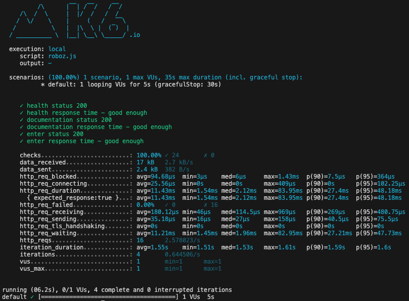

# roboz performance test

The idea here is to have some simple performance tests to benchmark the roboz service. 
However, given that the executions are so slow, this is currently not a meaningful exercise - as described in the parent [README.md](../README.md).

Default implementation tests the three endpoints exposed by the http server (`health`, `documentation`, `enter-path`)

## useful resources
* k6.io/docs

## useful commands
* brew install k6
* k6 version
* k6 run roboz.js

## terminal output example

